
# tarea2-peps
Para la entrega de la segunda tarea.

Pasos seguidos:
1. 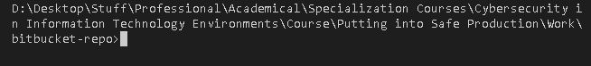 

Iniciamos el proyecto en local

2. 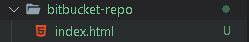 

Creamos algún archivo o hacemos alguna modificación.

3. 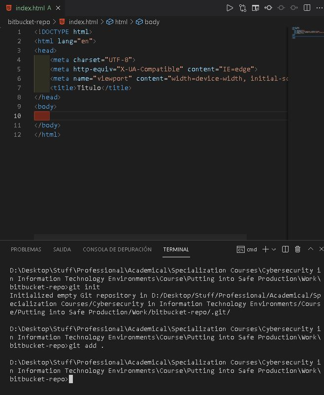 

Añadimos los archivos modificados

4. 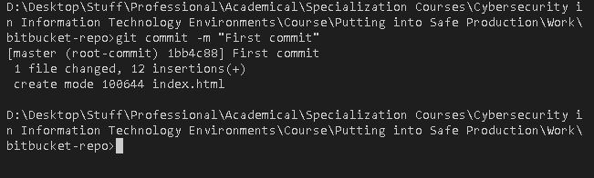 

Hacemos commit en local

5. 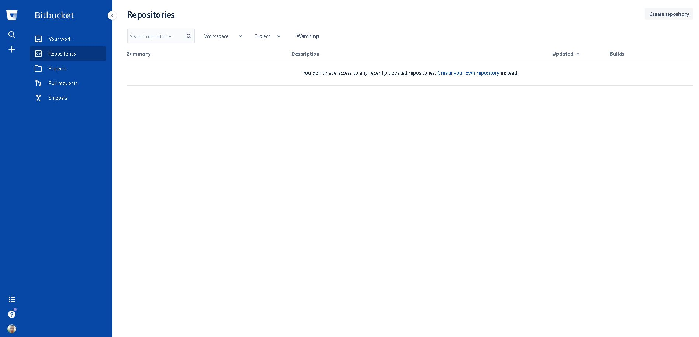 

Creamos un repositorio remoto en Bitbucket haciendo clic en "Create repository".

6. 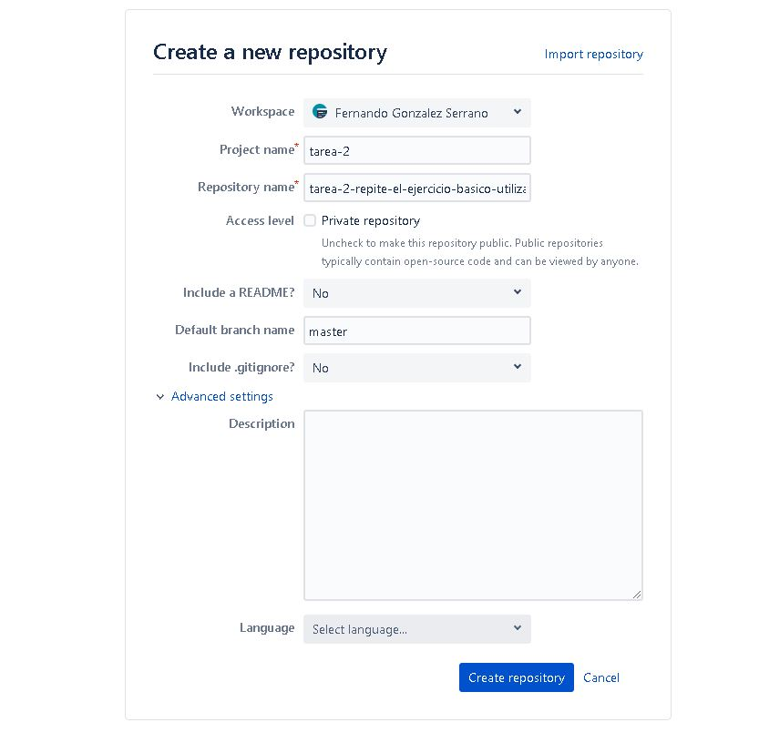 

Creamos un repositorio con un nombre y sin crear el README.

7. 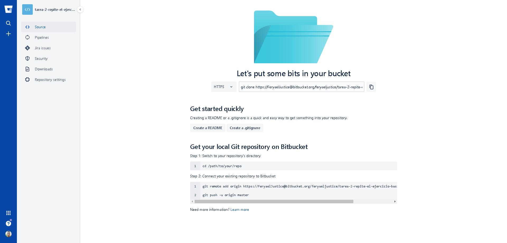 

Copiamos la URL para añadir el proyecto a nuestro repositorio Git local

8. 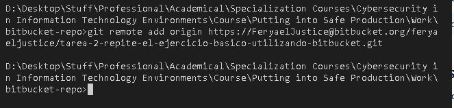 

Añadimos el repositorio remoto

9. 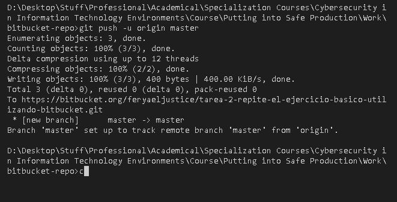 

Hacemos un git push (si es la primera vez que hacemos push en esa cuenta, nos pedirá las credenciales)

10. 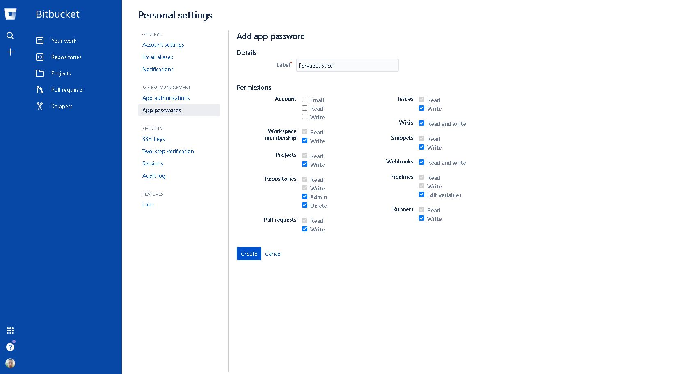 

Generamos un personal access token

11. 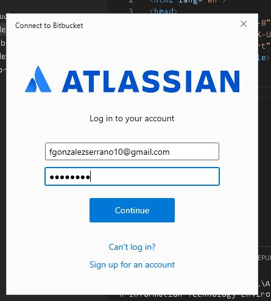 

Introducimos las credenciales y usamos el personal access token como contraseña

12. 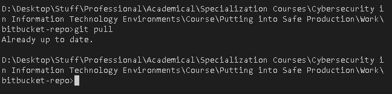 

Hacemos pull para incorporar los cambios que haya

13. 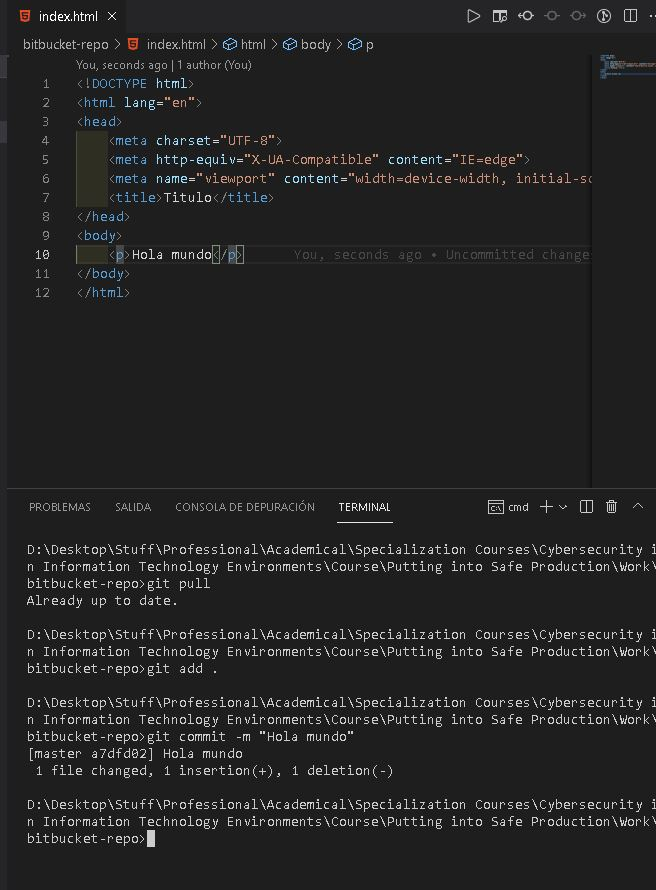 

Hacemos un cambio y hacemos commit

14. 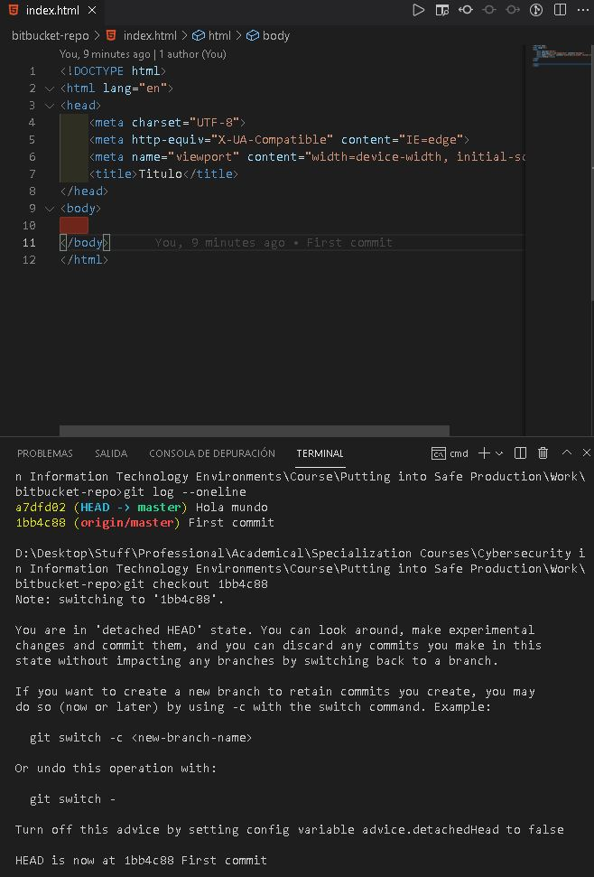 

Revertimos los cambios hasta otro commit usando su hash 
identificador, que obtenemos con el comando git log --oneline

15. 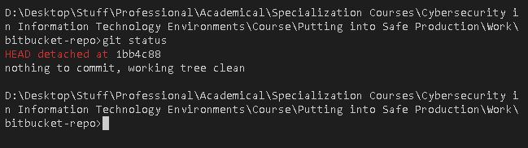 

Hacemos git status

Pasos en comandos:
git init
git remote add origin url_git
git add .
git commit -m "Initial commit"
git push -u origin master