
# tarea2-peps
Para la entrega de la segunda tarea.

Pasos seguidos:
1.  
Iniciamos el proyecto en local

2. 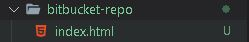 
Creamos algun archivo o modificación

3. 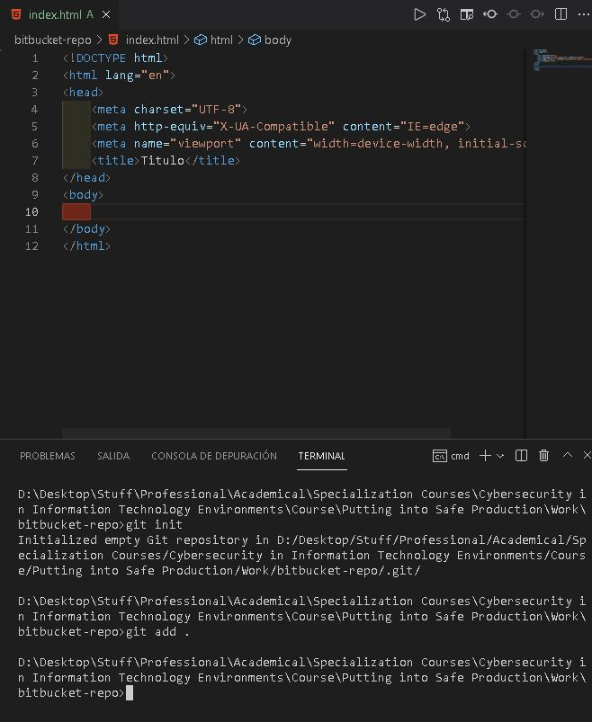 
Añadimos los archivos modificados

4.  
Hacemos commit en local

5. 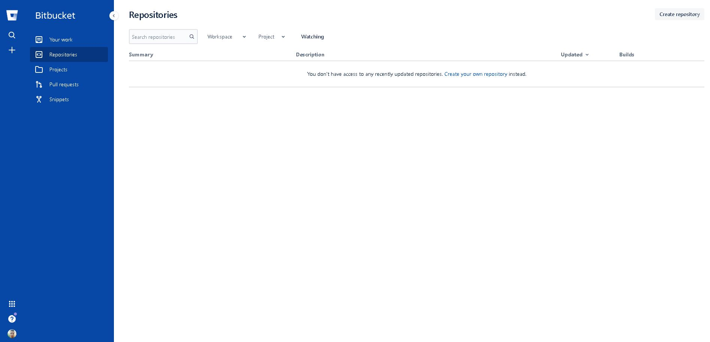 
Creamos repositorio remoto en Bitbucket dandole a "Create repository"

6. 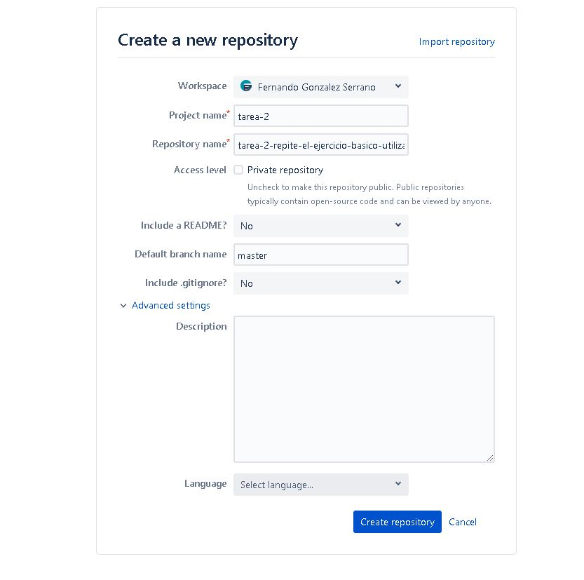 
Creamos con un nombre y sin crear el readme"

7. 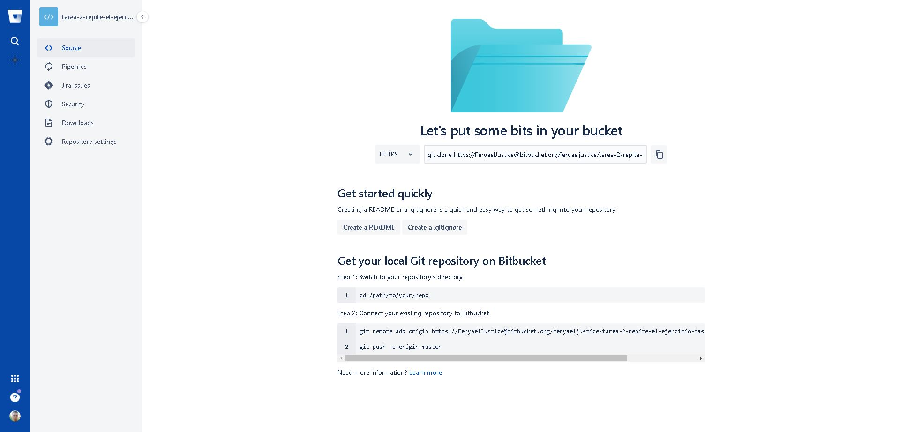 
Copiamos la url para añadir el proyecto a nuestro repositorio git local

8. 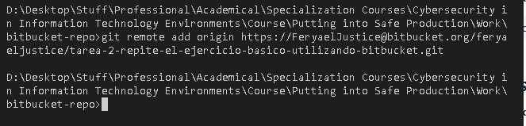 
Añadimos el repositorio remoto

9. 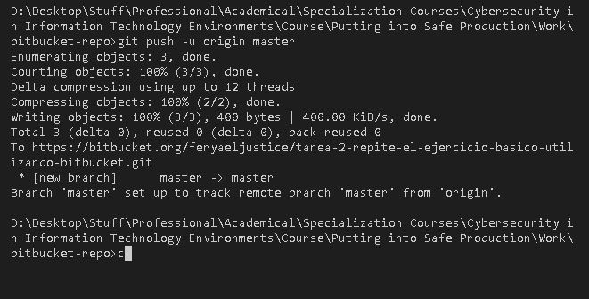 
Hacemos un git push (si es primera vez hacemos push en esa cuenta, nos pedira credenciales)

10. 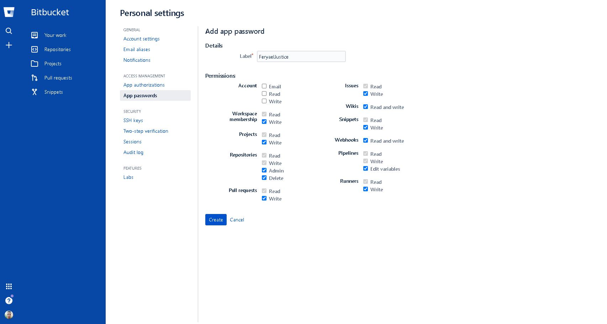 
Generamos un personal access token

11. 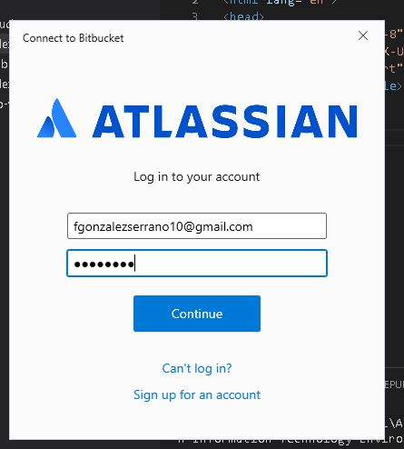 
Metemos las credenciales con el personal access token como password

12. 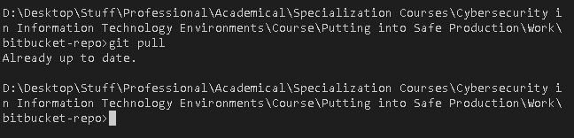 
Hacemos pull por si hay cambios traernoslos

13. 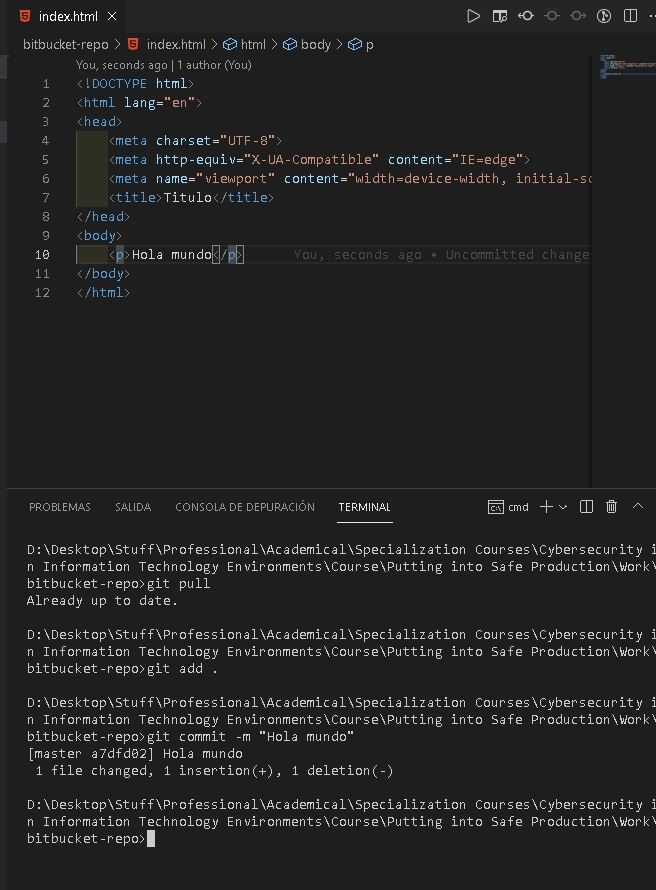 
Hacemos un cambio y hacemos commit

14. 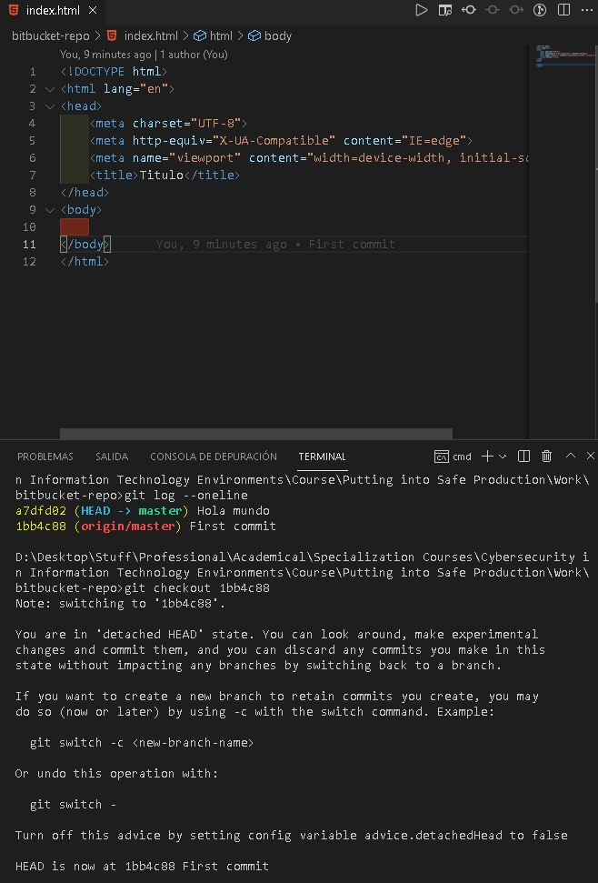 
Revertimos los cambios a otro commit cogiendo su hash 
identificador con el comando git log --oneline

15. 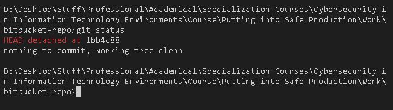 
Hacemos git status

Pasos en comandos:
git init
git remote add origin url_git
git add .
git commit -m "Initial commit"
git push -u origin master